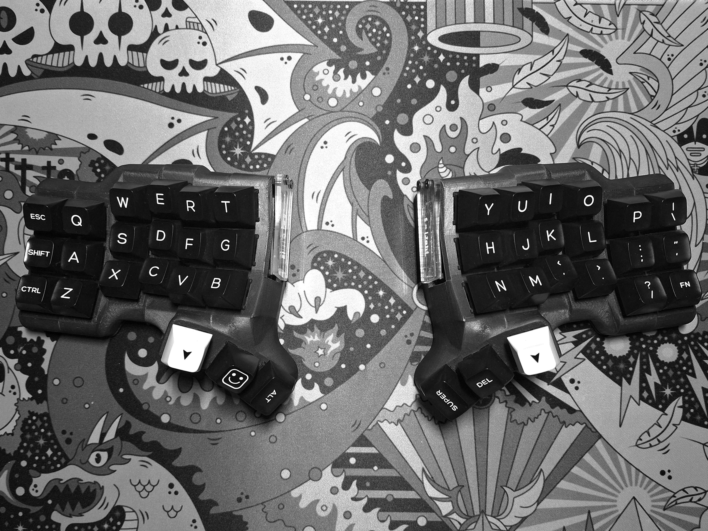
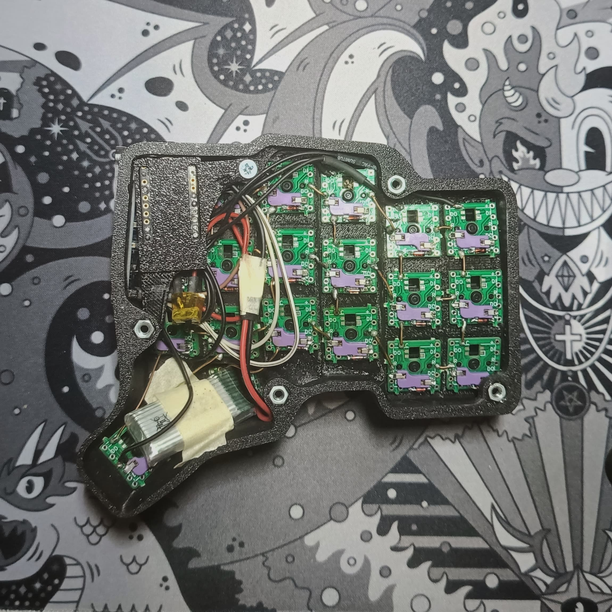
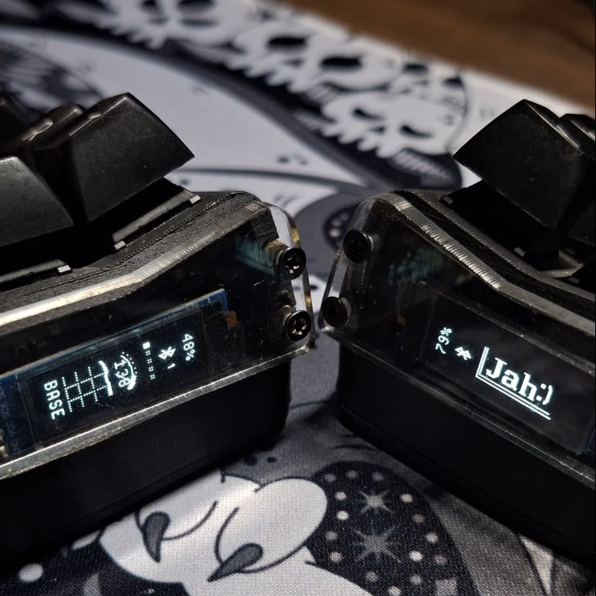

# TBK-"Micro" MK1
**TBK-"Micro" Mk1** is a modified version of the [TBK-Mini](https://github.com/Bastardkb/TBK-Mini/).  
The original design featured slits and gaps that gave the keyboard an "open" aesthetic which I redesigned to create a more compact and enclosed form factor while adding support for an integrated OLED screen. 
  
Keycaps: "WOB" SA profile doubleshot ABS 
## Parts
* [MxLEDBitPCB hotswappable switch PCB](https://github.com/swanmatch/MxLEDBitPCB)
* SuperMini NRF52840 chip for wireless connectivity via bluetooth
* OLED 0.91" 128x32, White
* Custom acrylic cover for OLED
* Brass standoffs
* 550mAh Battery
* GAZZEW BOBA BLACK U4 Silent Tactile
* PLA 3D printed case 
* MAGSAFE mountable bottom cover

## Gallery

---

### OLED views 
* Right split OLED display shows Battery level, bluetooth profile 1 to 5, WPM and WPM graph, and layer profile
* Left split shows a nice little _typing_ animation of the logo, along with the name.  
 

### Write-up and Rants
&nbsp;&nbsp;&nbsp;&nbsp;&nbsp;&nbsp;This was my first ever custom keyboard. I learned blender in order to manipulate and modify the base 3D model where I learned that vertices, and topology management, is hard... I even had a back and forth on whether to use CAD or Blender first, to see which one is easier. I finally decided on modifying simple shapes via CAD first. I then fine tuned using Blender. 

&nbsp;&nbsp;&nbsp;&nbsp;&nbsp;&nbsp;Soldering the diodes was an easy task. Wires however, is a challenge on its own; some broke off after soldering, even breaking the pads they were soldered on after the fact. I fixed this by using a lot of flux and adjusting the heat. The microcontroller's attachment is also not the best; I had to remove, soldering off some parts inside, and the USB port in order to make it fit. 

&nbsp;&nbsp;&nbsp;&nbsp;&nbsp;&nbsp;A custom sized acrylic cover was made using CAD, and ordered via a local acrylic cutting shop. I carefuly drilled holes for the acrylic using small drill bits (0.2mm to 0.8mm) as they were prone to shattering. Then brass inserts for the acrylic cover were inserted via solder heating. In the future, I will actually add holes for the inserts as inserting them via solder heating was messy, and the thin frame of the case made bulges on where the standoffs were inserted.

## Special Thanks To:
* [Bastardkb](https://github.com/Bastardkb/)
* ZMK, and the ZMK community
* ErgoMechKeyboards community
* [MxLEDBitPCB](https://github.com/swanmatch/MxLEDBitPCB) for the hotswap switch PCB
* [mctechnology17](https://github.com/mctechnology17/zmk-nice-oled/tree/main) for the extra OLED functionalities
## License
This project is a derivative of the [TBK Mini](https://github.com/OriginalRepo/TBK-Mini)  
licensed under the [Creative Commons Attribution-NonCommercial-ShareAlike 4.0 International License](https://creativecommons.org/licenses/by-nc-sa/4.0/).  
Accordingly, TBK-"Micro" MK1 is distributed under the same license.
